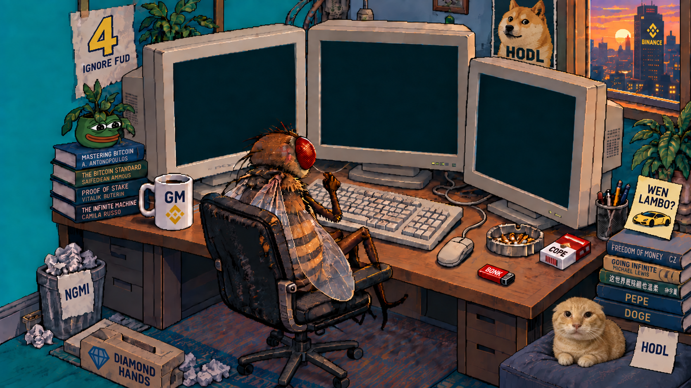

# FLY FUND

**A fruit fly. A fund. A desktop we all share.**

FLY FUND is an experiment on BNB Chain: feed a shared fly with $FLY and a message, observe its decisions, and follow the Fund's activity. The interface is a Windows 98-inspired crypto trading room.

Source: [Flyfundglobal/fly-fund](https://github.com/Flyfundglobal/fly-fund)

Project domain: **flyfund.global** — production deployment is being prepared.



## Current status

| Part | Status |
| --- | --- |
| Trading room website | Interactive preview: books, cigarette animation, roadmap and demo feeding |
| BNB / BTC / ETH prices | Live Binance market data through the site's API |
| Fund contracts | Source implemented; 23 local tests pass; not deployed or independently audited |
| Wallet / real token feeding | Not connected to the website yet |
| Fly neural model / decision service | Planned integration; not running in this repository yet |
| Individual fly airdrop | Roadmap, not a live claim |

There is no published $FLY contract address here yet. Demo feeding does not move tokens or persist after a refresh. BNCB pricing awaits a verified contract address.

## Repository

```text
app/                    Website, desktop interactions and market API
components/             UI components
public/                 Trading room artwork and retro icons
contracts/src/          FLY feeding/accounting and Fund vault contracts
contracts/test/         Local EVM and deployment-configuration tests
contracts/scripts/      Reproducible compiler and unsigned deployment preparation
docs/                   Development notes
```

The future model service, indexer and execution worker belong alongside these components when implemented; their presence is not implied by the current UI.

## Run the website

Use Node.js 22.13 or newer and npm.

```sh
npm ci --prefer-offline --no-audit --no-fund
npm run dev -- --port 5184
```

Open `http://localhost:5184/`.

To preview a compiled build locally:

```sh
npm run build
npm start -- --port 5185
```

The current build uses vinext/Vite and a Cloudflare Worker runtime. `npm start` is a local Wrangler preview, **not a VPS production service**. It serves a fixed build snapshot under `.sites-runtime/preview-releases`, retaining earlier hashed assets so rebuilding does not break visitors' open pages. Vultr production deployment needs the corresponding runtime/adapter work. Hosting details inherited from the starter are documented in [starter runtime notes](docs/starter-runtime.md).

## Build and test contracts

```sh
cd contracts
npm ci --prefer-offline --no-audit --no-fund
npm run build
npm test
```

Solidity 0.8.30, OpenZeppelin 5.4.0, optimizer 200, EVM target `paris`. The contract toolchain has its own lockfile and does not change the website dependencies.

See [contract mechanism and deployment notes](contracts/README.md) for APIs, accounting, custody, trade limits and real-token checks required before deployment.

The Fund accepts FLY contributions and BNB. A fixed executor can swap allowed assets through a fixed V2 router, with outputs returning to the vault. There is no arbitrary withdrawal or upgrade entrypoint. The executor is still an off-chain signer: this does not prove AI provenance or eliminate trading losses. Contributions are not redeemable shares or guaranteed yield.

## Roadmap

1. **Feed & Record** — connect wallets and persist confirmed on-chain feedings.
2. **Model & Memory** — connect the fly simulation to inputs and observable decisions.
3. **On-chain Actions** — operate the Fund within published contract rules and reconcile receipts.
4. **Your Own Fly** — eligible participants receive their own fly through an airdrop; rules are still to be defined.

## Configuration and credentials

Keep RPC credentials, API keys and signing keys outside version control. Environment files, local runtime state, build outputs and contract artifacts are ignored. Never embed an execution private key in frontend code. The unsigned deployment preparation script never signs or broadcasts transactions.

## Credits

Windows-style icons use React95 assets; attribution and license are in [public/icons](public/icons/SOURCE.txt). Third-party runtime and stylesheet notices remain alongside their files. The planned neural integration references the independent [flybrain / fly.ai project](https://github.com/alextitonis/fly.ai); this repository does not claim authorship of that model or affiliation with Binance.
